# Examen rsync

## Primer ejercicio

### Copia inicial completa
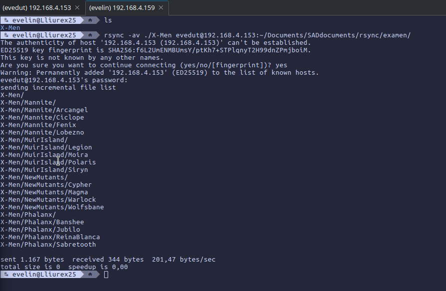
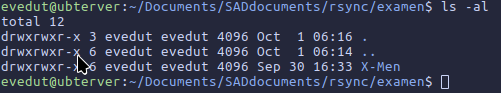

## Segundo ejercicio

### Copia en /copias
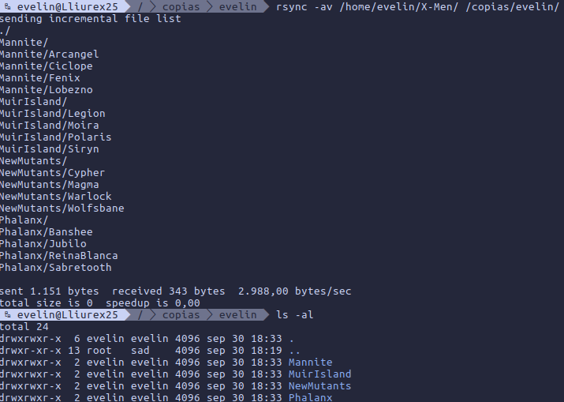

### Backup en /incremental
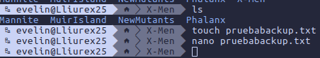
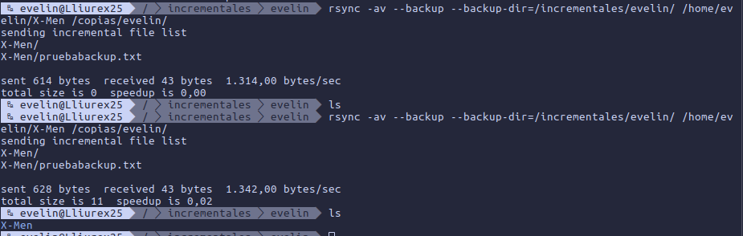
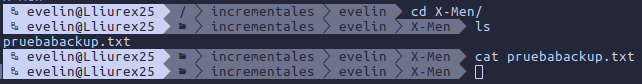
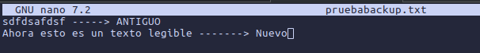
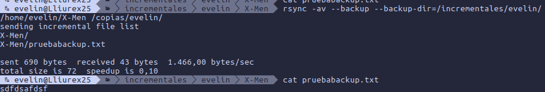

### Backup en /incremental borrando archivos
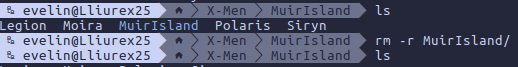
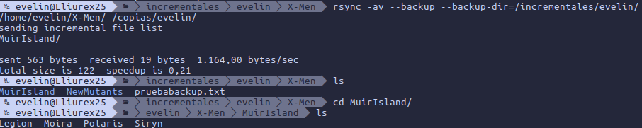

### En caso de haber borrado y no haber hecho el backup
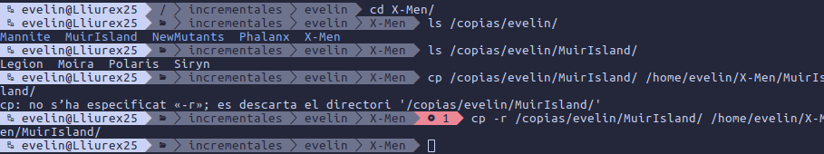