#  TAREA 4 - SSH

### ÍNDICE

---
### Fichero de configuración sshd.config

ATENCIÓN, antes de avanzar con la tarea hay que asegurarnos de instalar el openssh-server en el servidor y tener instalado el ssh-client en el equipo cliente.

Para entrar en el fichero de configuración tendremos que entrar en "sshd.config", si no sabemos en que ruta está podremos ejecutar el comando de la siguiente captura:

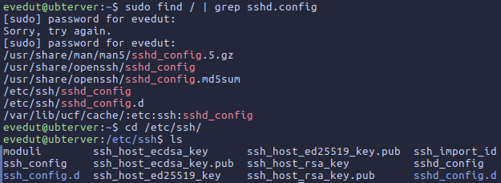

Una vez dentro cambiaremos las siguientes propiedades:
- Deshabilitar passwords en blanco

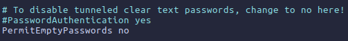

Esto lo necesitaremos para más adelante:

- Cambiar el puerto por defecto

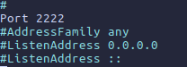

- Deshabilitar el login de root a través de ssh

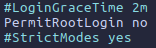

- Deshabilitar el protocolo 1 de ssh

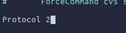

- Configurar un intervalo de inactividad de la sesión

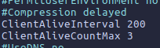

- Permitir el acceso únicamente a ciertos usuarios

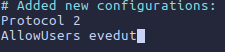

Una vez hecho todo esto, haremos un `sudo systemctl restart sshd`

Para comprobar que las propiedades se han aplicado, intentaremos hacer un ssh normal para que nos diga que no roconoce la conexión por el puerto 22:

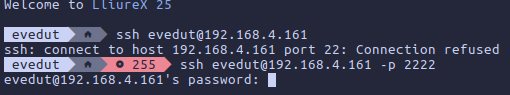

---
### Permitir login por cifrado asimétrico

Para poder hacer un loggin sin contraseña y utilizando exclusivamente cifrado asimétrico ssh, primero tendremos que deshabilitar el "PasswordAuthentication" en el archivo "sshd.config" como aclaramos anteriormente:

Continuamos con la generación de claves:

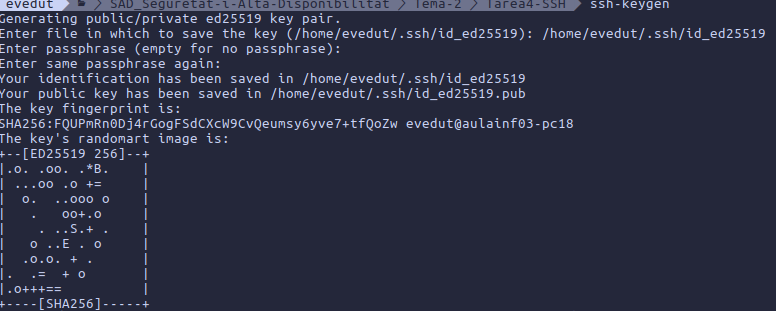

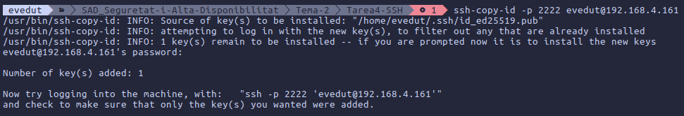

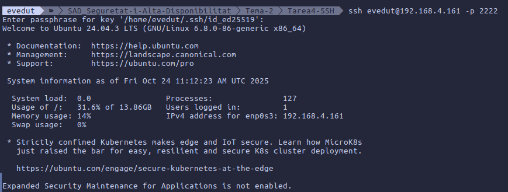

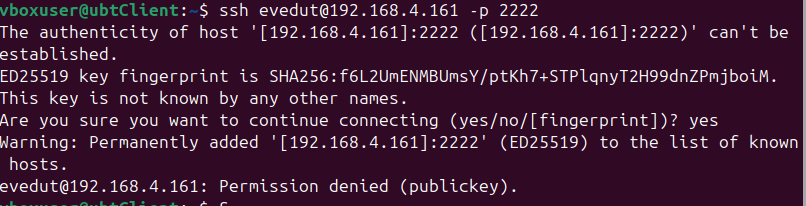