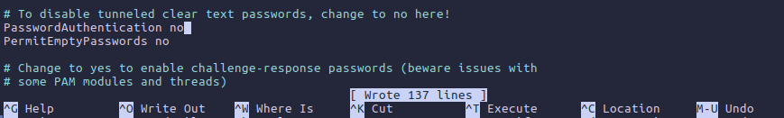

#  TAREA 4 - SSH

### ÍNDICE

1. [Fichero de configuración sshd.config](#fichero-de-configuración-sshdconfig)

2. [Permitir login por cifrado asimétrico](#permitir-login-por-cifrado-asimétrico)

 

---
### Fichero de configuración sshd.config

**ATENCIÓN**, antes de avanzar con la tarea hay que asegurarnos de instalar el openssh-server en el servidor y tener instalado el ssh-client en el equipo cliente.

Para entrar en el fichero de configuración tendremos que entrar en "*sshd.config*", si no sabemos en que ruta está podremos ejecutar el comando de la siguiente captura:

Una vez dentro cambiaremos las siguientes propiedades:
- Deshabilitar passwords en blanco

Esto lo necesitaremos para más adelante:

- Cambiar el puerto por defecto

- Deshabilitar el login de root a través de ssh

- Deshabilitar el protocolo 1 de ssh

- Configurar un intervalo de inactividad de la sesión

- Permitir el acceso únicamente a ciertos usuarios

Una vez hecho todo esto, haremos un `sudo systemctl restart sshd`

Para comprobar que las propiedades se han aplicado, intentaremos hacer un ssh normal para que nos diga que **no roconoce la conexión por el puerto 22**:

 

---
### Permitir login por cifrado asimétrico

Para poder hacer un loggin sin contraseña y utilizando exclusivamente **cifrado asimétrico** ssh, primero tendremos que deshabilitar el "PasswordAuthentication" en el archivo "sshd.config" como aclaramos anteriormente:

Continuamos con la generación de claves.

Para obtener las claves, ejecutamos `ssh-keygen` :

Una vez generada la clave, copiamos la *ID de la clave pública de nuestro servidor SSH*:

En el momento de copiarla, nos pedirá que añadamos un "password" el cual nos pedirá siempre que queramos conectarnos por ssh a ese servidor. **ATENCIÓN** con recordar la contraseña, si la olvidamos, **no podremos recuperarla**.

Ahora que ya tenemos nuestra "password" o contraseña, intentaremos hacer un ssh para ver que efectivamente nos la pide:

Ahora en caso de no haber quitado el "PasswordAuthentication", lo inhabilitaremos.

Desde la máquina cliente que hemos hecho todos los pasos nos dejará conectarnos sin problemas porque esta **reconocida su clave pública**, pero si tratamos de conectarnos desde otro cliente este será el resultado:

