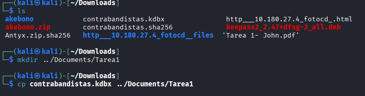
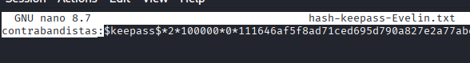
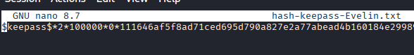
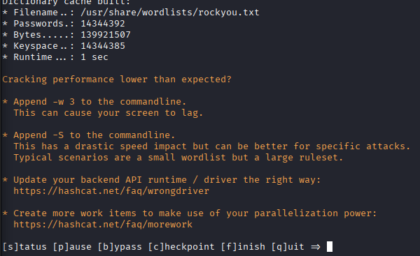
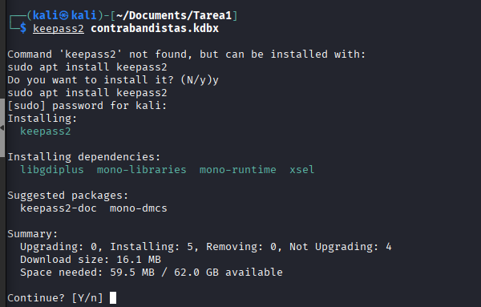
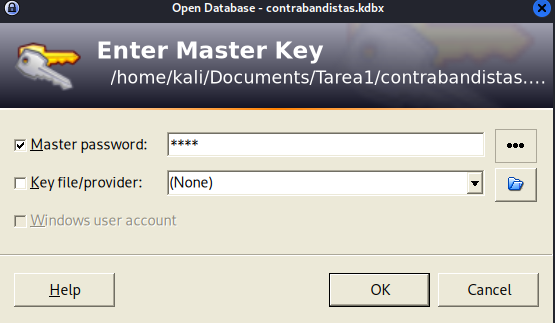

#  TAREA 1 - JohnTheRipper

### ÍNDICE

1. [Keepass](#keepass)
2. [Permitir login por cifrado asimétrico](#permitir-login-por-cifrado-asimétrico)

</br>

---
### Keepass

El primer paso será descargarse todos los ficheros necesarios para proceder con la práctica y algunos requisitos mínimos, como por ejemplo:
    - Archivo .kdbx
    - Zip .sha256
    - Tener instalado el paquete keepass2john
    - Tener instalado el paquete john (Ya instalado con Kali Linux)
    - Tener instalado el paqquete hascat (Ya instalado con Kali Linux)



El fichero acabado en `.kdbx` es un archivo de base de datos de contraseñas, por lo que lo convertiremos en un `.txt` (extraemos su hash dentro de el archivo **.txt**) de la siguiente forma:

```sh
keepass2john contrabandistas.kdbx > hash-keepass-Evelin.txt
```

Dentro el contenido será el siguiente.


En la imágen se muestra resaltado el nombre "contrabandistas:". Eso se debe a que tendremos que borrar por completo lo que venga antes del **$keepass** ya que de lo contrario nos dará problemas más adelante.





Cuando tengamos instalado nuestro paquete `john`, se creará el archivo `/usr/share/wordlist/rockyou.txt.gz` . Este fichero contiene millones de contraseñas reales filtradas de una brecha de seguridad antigua (RockYou, 2009). Se utiliza para hacer ataques de fuerza bruta. Para que podamos utilizarlo tendremos que descomprimirlo. Por ello ejecutamos:

```sh
gunzip /usr/share/wordlist/rockyou.txt.gz
```

El siguiente comando intentará descifrar la contraseña comparando los hashes de la lista rockyou y el hash generado con anterioridad con `keepass` .

```sh
john --wordlist=/usr/share/wordlist/rockyou.txt hash-keepass-Evelin.txt
```










