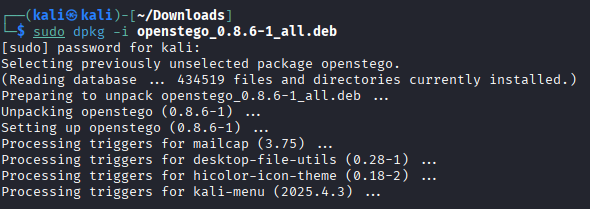
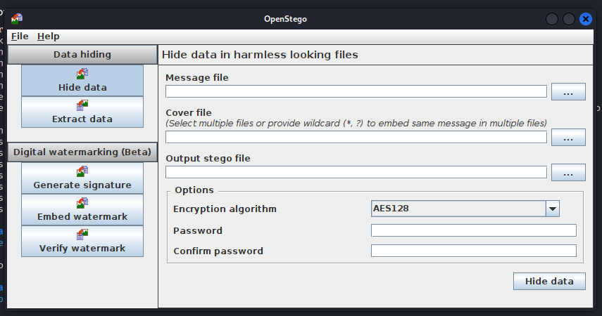
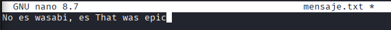
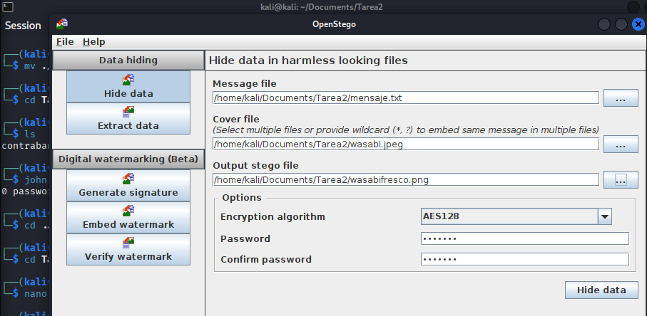
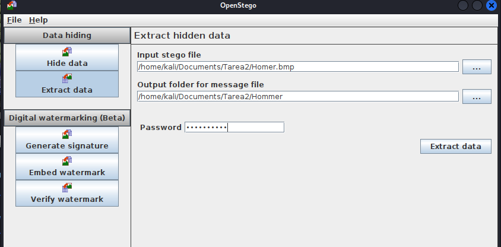
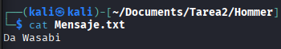
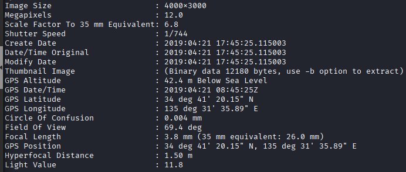

#  TAREA 2 - Esteganografía

### ÍNDICE

1. [Preparativos](#preparativos)
2. [Esconder datos en una imagen](#esconder-datos-en-una-imagen)

</br>

## Preparativos

Primero será descargar el programa `openstego` , este es el [enlace de descarga](https://www.openstego.com/).



## Esconder datos en una imagen

Una vez instalado el paquete, para abrir el programa basta con escribir `openstego` en la terminal:

```sh
openstego
```



Seleccionamos la opción de "Hide data" y tendremos que rellenar los campos de **"Message file", "Cover file", "Output stego file", y password**.

Antes de poner los ficheros, vamos a tener que crear un `mensaje.txt` con un texto dentro para que nuestra imagen tenga un mensaje secreto:



Ahora sí, nos aseguramos de seleccionar las imágenes correctas y le ponemos una contraseña (en mi caso es: wasabi?)

Una vez lo hemos rellenado todo, hacemos clic en el botón "Hide data" en la parte inferior derecha, y se nos generará una imagen con un mensaje escondide y cifrado con contraseña.




Ahora lo haremos al revés, extraer los datos de una imagen. Seleccionamos la imagen con el mensaje cifrado, la carpeta donde queremos guardar el archivo `.txt` con el mensaje, y luego la contraseña:



Todo para darnos cuenta que el mensaje es el siguiente...




Finalmente vamos a explicar como utilizar `exiftool` , una herramienta para mostrar cualquier tipo de dato/información de una imagen, una herramienta bastante peligrosa que puede mostrar información sensible.

El paquete no viene instalado por defecto asi que lo instalaraemos de la siguiente manera:

```sh
sudo apt update
sudo apt install exiftool
```

Una vez instalado, bastara con escribir `exiftool` antes del archivo en la terminal para su uso.

```sh
exiftool imagen.jpg
```

Esto es un ejemplo de los datos más importantes que puede mostrar la herramienta:

