#  TAREA 1 - Retos de cortafuegos básico

### ÍNDICE

1. [Limpieza de reglas](#1-limpieza-de-reglas)
2. [Estado actual con "iptables"](#2-estado-actual-con-iptables)
3. ["nmap"](#3-nmap)
4. [Aplicar políticas ACCEPT](#4-aplicar-políticas-accept)
5. [Instalar Apache y SSH](#5-instalar-apache-y-ssh)
6. [Comprobación de servicio web](#6-comprobación-de-servicio-web)
7. [Comporbación de puertos con nmap](#7-comporbación-de-puertos-con-nmap)
8. [Configuración DROP](#8-configuración-drop)
9. [Denegación de puertos](#9-denegación-de-puertos)
10. [Permitir acceso a una única direccion IP](#10-permitir-acceso-a-una-única-direccion-ip)
11. [Comprobación del funcionamiento IP](#11-comprobación-del-funcionamiento-ip)
12. [Permitir acceso a puertos específicos](#12-permitir-acceso-a-puertos-específicos)
13. [Comprobacion funcionamiento del ping](#13-comprobacion-funcionamiento-del-ping)
14. [Comprobación mediante ping](#14-comprobación-mediante-ping)
15. [INPUT o OUTPUT](#15-input-o-output)
16. [FTP](#16-ftp)
17. [Comprobación de acceso FTP](#17-comprobación-de-acceso-ftp)
18. [Configuración persistente de iptables](#18-configuración-persistente-de-iptables)

</br>

---
## 1 Limpieza de reglas

Primero dejamos el firewall vacío, sin reglas.

```sh
sudo iptables -F
sudo iptables -X
sudo iptables -Z
```

Opciones:
-F --> borra todas las reglas
-X --> borra cadenas personalizadas
-Z --> pone los contadores a cero

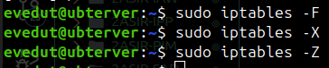


## 2 Estado actual con "iptables"

```sh
sudo iptables -L -v -n
```

Opciones:
- -L --> lista reglas
- -v --> información detallada
- -n --> no convierte IPs a nombres

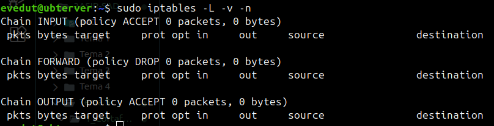


## 3 "nmap"

Para comprobar que está instalado:

```sh
nmap --version
```

Si no está instalado:

```sh
sudo apt install nmap
```
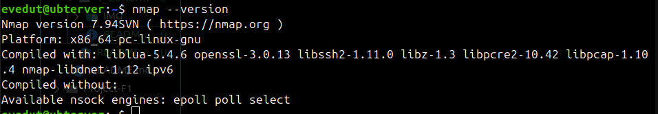


## 4 Aplicar políticas ACCEPT

Las ponemos todas en ACCEPT:

```sh
sudo iptables -P INPUT ACCEPT
sudo iptables -P OUTPUT ACCEPT
sudo iptables -P FORWARD ACCEPT
```

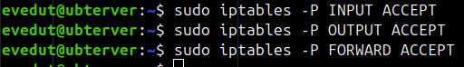


## 5 Instalar Apache y SSH

Si no tenemos Apache2 o SSH instalado, ejecutamos:

```sh
sudo apt update
sudo apt install apache2 openssh-server
```

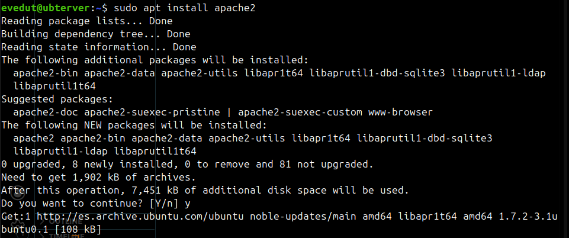


## 6 Comprobación de servicio web

Si accedemos a la web:

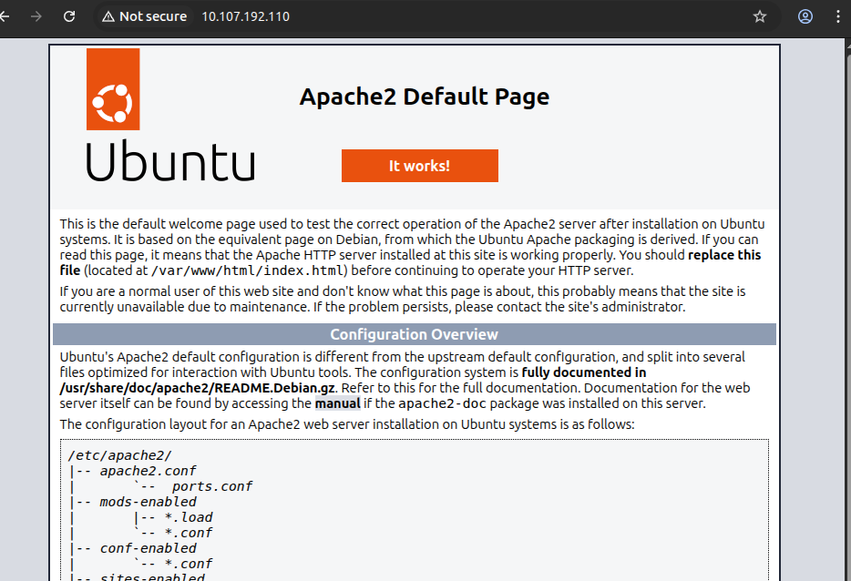

O hacemos un ssh:

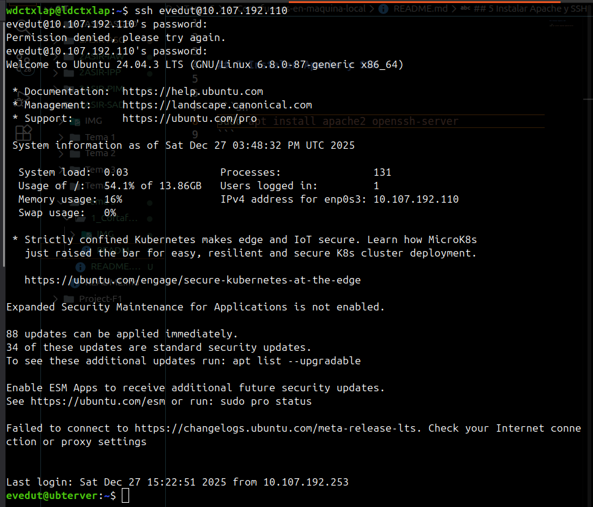

Vemos que funciona correctamente.


## 7 Comporbación de puertos con nmap

Hacemos desde el cliente

```sh
nmap ip_servidor
```

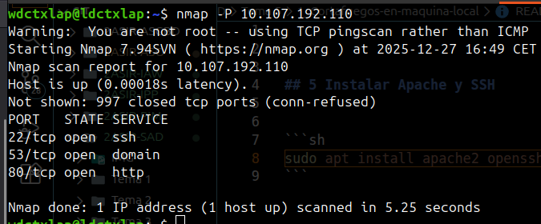


## 8 Configuración DROP

Ahora el firewall será estricto

```sh
sudo iptables -P INPUT DROP
sudo iptables -P OUTPUT DROP
sudo iptables -P FORWARD DROP
```

Comprobamos:

```sh
sudo iptables -L -v -n
```

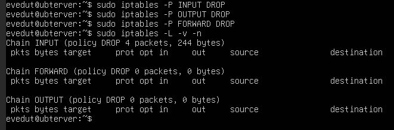

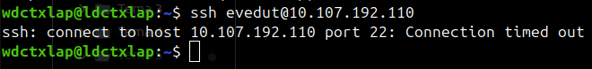


## 9 Denegación de puertos

Tanto el servidor web, ssh como el ping no funcionaran porque lo hemos denegado todo.

```sh
ping ip_servidor
```

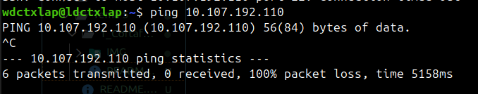


## 10 Permitir acceso a una única direccion IP

Vamos a permitir el acceso a única IP:

```sh
sudo iptables -A INPUT -s ip_cliente -j ACCEPT
sudo iptables -A OUTPUT -d ip_cliente -j ACCEPT
```

¿Por qué dos reglas?
- INPUT --> recibir datos
- OUTPUT --> responder
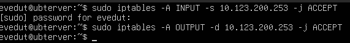


## 11 Comprobación del funcionamiento IP

Ahora que hemos habilitado la IP de nuestro cliente, todo funcionará como antes:


## 12 Permitir acceso a puertos específicos

Abriremos solo los puertos 80, 443 y 22
```sh
sudo iptables -A INPUT -p tcp --dport 80 -j ACCEPT
sudo iptables -A INPUT -p tcp --dport 443 -j ACCEPT
sudo iptables -A INPUT -p tcp --dport 22 -j ACCEPT

sudo iptables -A OUTPUT -p tcp --sport 80 -j ACCEPT
sudo iptables -A OUTPUT -p tcp --sport 443 -j ACCEPT
sudo iptables -A OUTPUT -p tcp --sport 22 -j ACCEPT
```

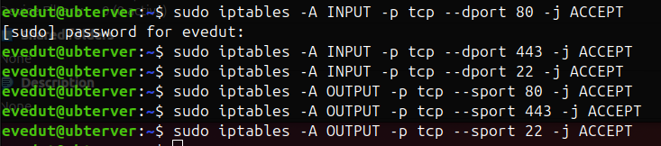

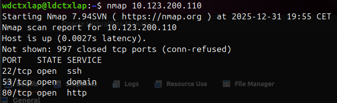


## 13 Comprobacion funcionamiento del ping

```sh
ping ip_servidor
```


El ping funciona porque Linux hace seguimiento de conexiones (conntrack).
**Aunque OUTPUT esté en DROP**, las respuestas a conexiones ya aceptadas pueden salir **si están marcadas como ESTABLISHED o RELATED**.

## 14 Comprobación mediante ping


Permitimos que se pueda hacer ping a una IP en específico.

```sh
sudo iptables -A INPUT -p icmp --icmp-type echo-request -s ip_cliente -j ACCEPT
sudo iptables -A OUTPUT -p icmp --icmp-type echo-reply -d ip_cliente -j ACCEPT
```

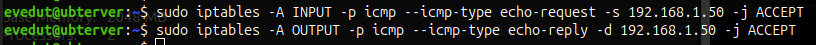

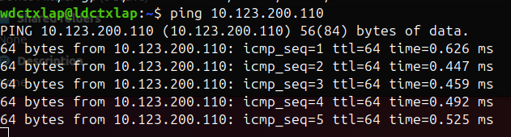


## 15 INPUT o OUTPUT

Solo INPUT es suficiente

¿Por qué?

Si el servidor no recibe la petición de ping, no hay nada que responder. OUTPUT no importa

## 16 FTP

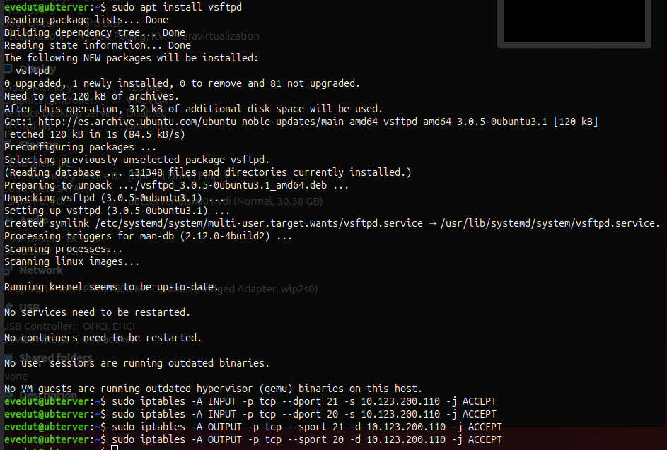

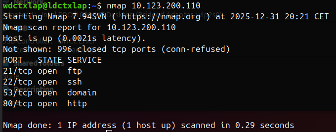


Para entender como funciona el puerto activo e inactvo de ftp, se puede consultar el siguiente [enlace](https://slacksite.com/other/ftp.html#activo)

## 17 Comprobación de acceso FTP

Hacemos un `nmap` para comprobar si el puerto FTP está abierto: 

```sh
nmap ip_servidor
```

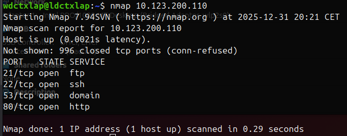

## 18 Configuración persistente de iptables

```sh
sudo apt install iptables-persistent
```

Le decimos que "Yes" o "Si":


Vamos a necesitar de un reinicio para que funcione:

```sh
sudo reboot
```

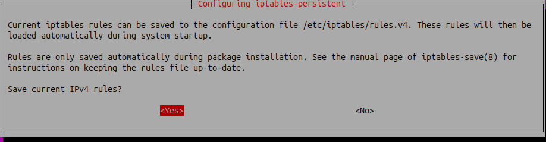

Ahora vemos que funciona:

```sh
sudo iptables -L -v -n
```

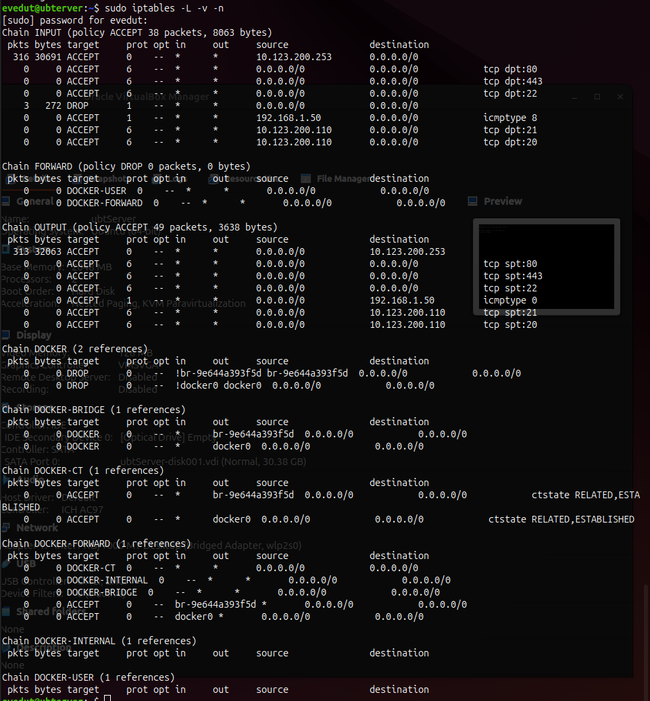

